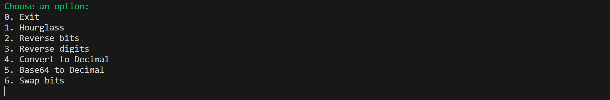
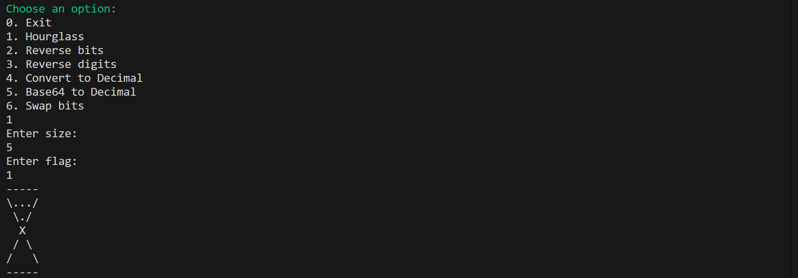

# Ex2 - Loops and Conditions

This mini-project contains several exercises demonstrating loops and bit/number manipulations in C.

## Menu

The program displays the following menu:

## Table of Contents

1. [Hourglass](#hourglass)
2. [Reverse bits](#reverse-bits)
3. [Reverse digits](#reverse-digits)
4. [Convert to Decimal](#convert-to-decimal)
5. [Base64 to Decimal](#base64-to-decimal)
6. [Swap bits](#swap-bits)

## Examples

### Hourglass
This exercise demonstrates a simple Hourglass pattern using loops in C.

The program will ask for a **size** – the size of the hourglass, and a **flag** – 0 or 1 depending on whether the sand is at the top or bottom.  

For example, size 5 and flag 1:

### Reverse bits
This exercise demonstrates reversing the bits of an integer using bitwise operations in C.

The program will ask you to **enter a number**. It will then reverse the bits of that number and display the result.  

For example, entering the number `50`:

### Reverse digits
This exercise demonstrates reversing the digits of an integer using loops in C.

The program will ask you to **enter a number**. It will then reverse the digits of that number and display the result.

For example, entering the number `12345`:

### Convert to Decimal
This exercise demonstrates converting a number from a given base to decimal in C.

The program will ask you to **enter the base** and then **enter the number** in that base. It will then convert the number to decimal and display the result.

For example, entering base `5` and number `1234`:

### Base64 to Decimal
This exercise demonstrates converting a Base64 encoded number to decimal in C.

The program will ask you to **enter a Base64 number**. It will then convert it to decimal and display the result.

For example, entering `A1`:

### Swap bits
This exercise demonstrates swapping two bits of an integer in C.

The program will ask you to **enter a number** and then **enter two indexes** representing the bits to swap. It will display the result after swapping.

For example, entering number `4` and indexes `1 2`:

