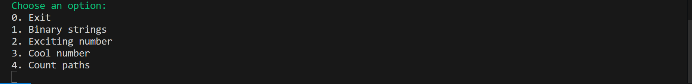

# Ex3 – Recursion

This mini-project contains several exercises demonstrating recursion in C.

## Menu

The program displays the following menu:

## Table of Contents

1. [Binary strings](#binary-strings)
2. [Exciting number](#exciting-number)
3. [Cool number](#cool-number)
4. [Count paths](#count-paths)

## Examples

### Binary strings
This exercise demonstrates generating all binary strings of a given length **without two consecutive 1s**.

The program will ask you to **enter the length** of the binary strings. It will then display all valid strings following the rule.

For example, entering length `5`:

### Exciting number
This exercise checks whether a given number is an **exciting number** – a number equal to the sum of its digits each raised to the power of the number of digits.

The program will ask you to **enter a natural number**.  

For example, entering `153`:

### Cool number
This exercise checks whether a given number is a **cool number**.  

A Cool Number is a natural number `N` that can be reconstructed as the sum of its preceding `D` terms in a unique sequence, where `D` is the number of digits in `N`.

The program will ask you to **enter a natural number**.  

For example, entering `120`:

### Count paths
This exercise demonstrates counting the number of legal paths in a grid using recursion in C.

The program simulates a dog making its way to a bone on a grid. The dog **cannot move 3 steps consecutively in the same direction**.

The program will ask you to **enter the width and height** of the grid. It will then calculate and display the number of legal paths.

For example, entering width `3` and height `3`:

