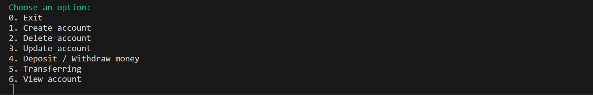
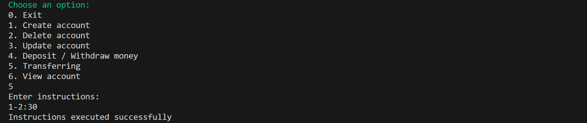

# Ex5 - Bank

This mini-project demonstrates a simple banking system in C, allowing users to manage accounts, deposit/withdraw money, and make transactions.

## Menu

The program displays the following menu:

## Table of Contents

1. [Create Account](#create-account)
2. [Delete Account](#delete-account)
3. [Update Account](#update-account)
4. [Deposit / Withdraw Money](#deposit--withdraw-money)
5. [Transferring](#transferring)
6. [View Account](#view-account)

## Examples

### Create Account
This option allows the user to create a new bank account by providing an account number and the account holder's name.

For example, creating an account with number `1` and holder `Alice`:

### Delete Account
This option allows the user to delete an existing bank account by entering its account number.

For example, deleting account number `3`:

### Update Account
This option allows the user to update the account holder's name for an existing account.  

For example, updating account number `1` to have the new holder `John Doe`:

### Deposit / Withdraw Money
This option allows the user to **deposit or withdraw money** from an existing account.  

For example, depositing `100` units into account number `1`:

### Transferring
This option allows the user to **transfer money between accounts** by specifying the instructions in the format `source-target:amount`.  

For example, transferring `30` units from account `1` to account `2`:

### View Account
This option allows the user to **view account details**, including the holder's name, current balance, and transaction history.  

For example, viewing account `1`:

