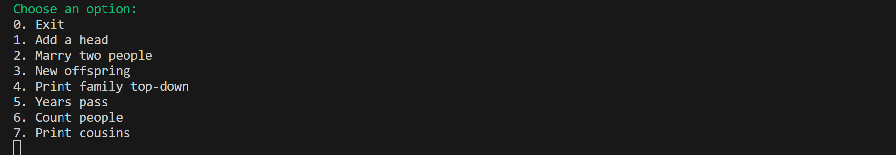

# Ex6 - New World

This mini-project demonstrates a simple family tree simulation in C.

## Menu

The program displays the following menu:

## Table of Contents

1. [Add a head](#add-a-head)
2. [Marry two people](#marry-two-people)
3. [New offspring](#new-offspring)
4. [Print family top-down](#print-family-top-down)
5. [Years pass](#years-pass)
6. [Count people](#count-people)
7. [Print cousins](#print-cousins)

## Examples

### Add a head
This option allows the user to **add the first person (head)** to the family tree by providing a name and an age.

For example, adding a head named `Alice` aged `20`:

### Marry two people
This option allows the user to marry two existing people in the world.  
The program asks for the names of both individuals and confirms the marriage once completed.  

For example, marrying `Bob` and `Alice`:

### New offspring
This option allows the user to create a new offspring (child) between two existing married individuals.  
The program asks for the names of both parents and then the name of the newborn child.  
Once entered, the program confirms the birth.  

For example, creating a child named `Charlie` from parents `Bob` and `Alice`:

### Print family top-down
### Print Family Top-Down
This option displays the selected person's family tree from the top down.  
It shows the person, their spouse (if any), and all descendants indented below them.  
Each individual is displayed with their current age in parentheses.  

For example, printing the family of `Bob`:

### Years pass
This option simulates the passage of time by increasing the age of all people in the family.  

For example, aging the family by 1 year:

### Count people
This option displays the total number of people currently in the family.  

For example, after adding members:

### Print cousins
This option lists the cousins of a given person up to a specified degree.  

For example, querying cousins of `Charlie` with degree `2`:

