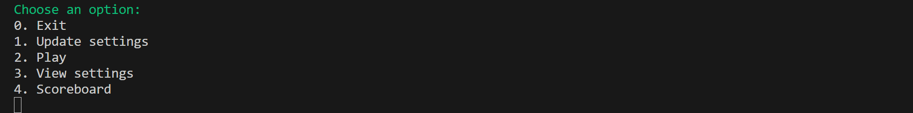
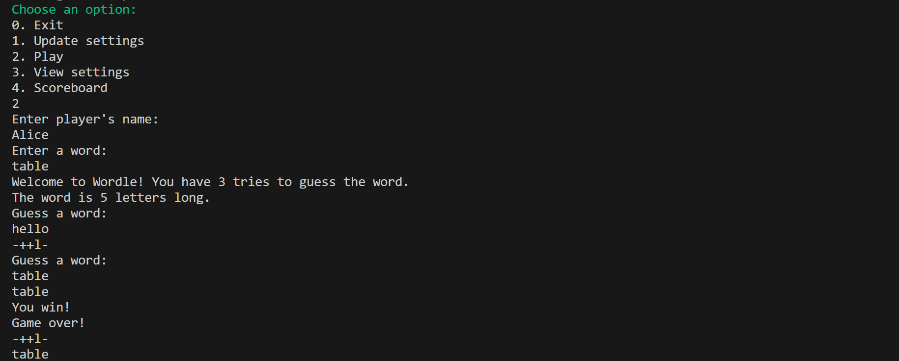
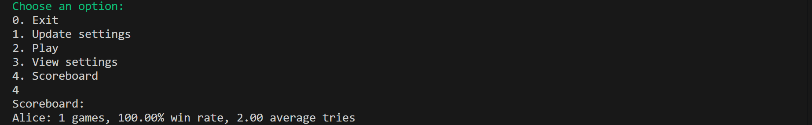

# Ex7 - Wordle

This mini-project is a Wordle-style game implemented in Python.

## Menu

The program displays the following menu:

## Table of Contents

1. [Update Settings](#update-settings)
2. [Play](#play)
3. [View Settings](#view-settings)
4. [Scoreboard](#scoreboard)

### Update Settings
This option allows the user to update the Wordle game settings, such as the number of tries or the word length.  

For example, updating the number of tries to `3`:

### Play
This option allows the player to start a new Wordle game.  
The player enters their name and then tries to guess the secret word within the allowed number of tries.  
Feedback is given after each guess, showing correct letters in the correct position (`+`) and correct letters in the wrong position (`-`).

For example, starting a game with player `Alice` and secret word `table`:

### View Settings
This option allows the player to view the current game settings, such as the file path for the word list, the number of allowed tries, and the word length.

For example, viewing the settings might display:

### Scoreboard
This option displays the performance of players, including the number of games played, win rate, and average number of tries.

For example, the scoreboard might show:

